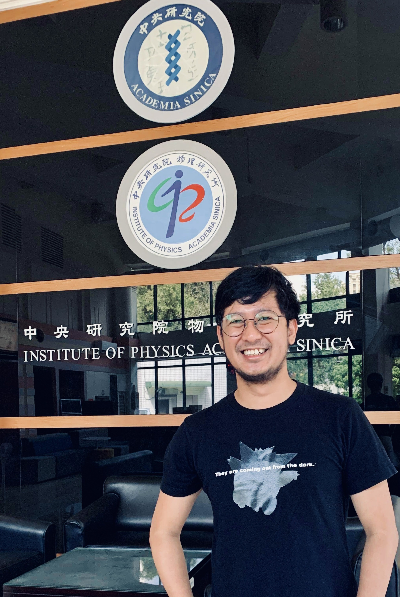
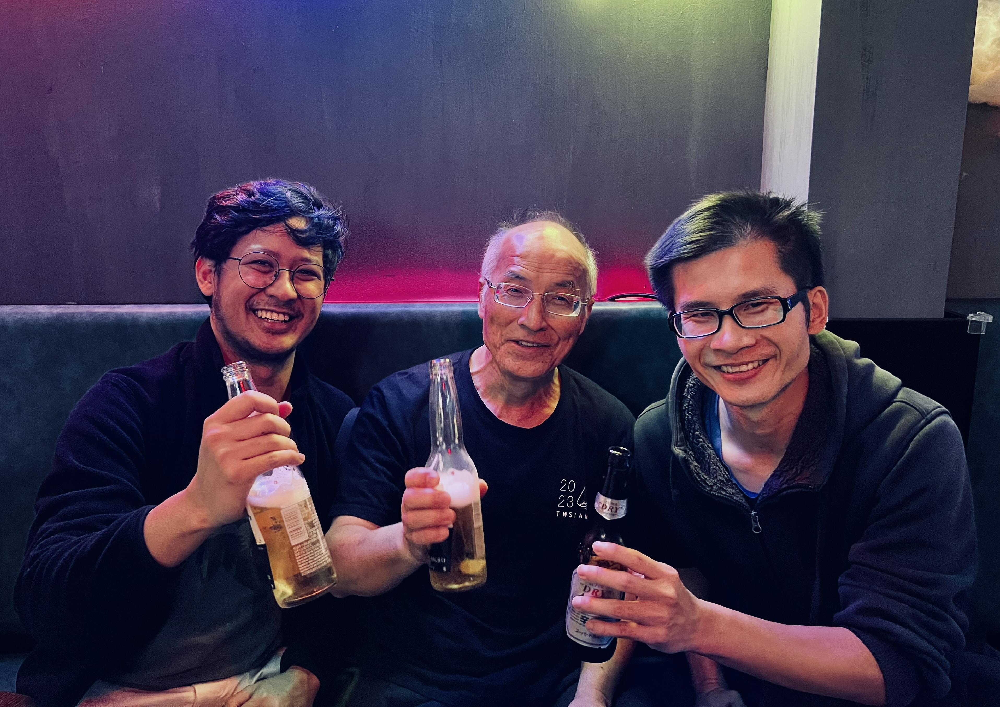
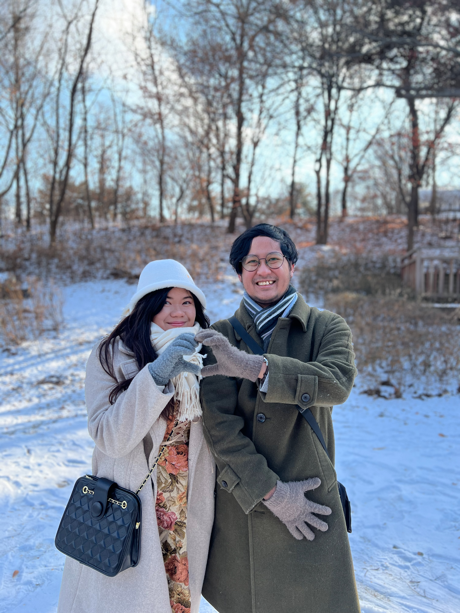
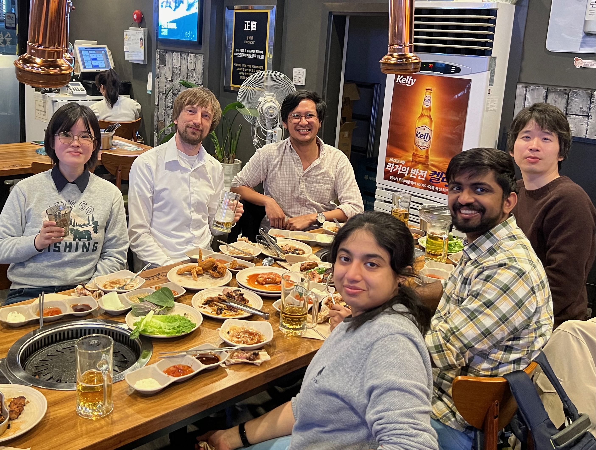

### Origin

I hail from [Calamba, Philippines](https://en.wikipedia.org/wiki/Calamba,_Laguna). In this city, rich in history and beauty, I completed my high school and part-seminary education. Afterwards, I went to physics.

### Academic Journey

I underwent rigorous scientific training (BS 2015; MS 2017; PhD 2020) at the [National Institute of Physics](http://nip.upd.edu.ph/) at the [University of the Philippines](https://upd.edu.ph/). My academic journey has been featured in various local news; see my favorite picks by [FlipScience](https://www.flipscience.ph/news/features-news/features/reginald-bernardo-gravitational-physicist), [ABS-CBN News](https://news.abs-cbn.com/spotlight/06/07/20/beyond-einstein-a-young-pinoy-physicist-shines-light-on-black-holes-dark-energy), and [Davao Today](http://davaotoday.com/main/economy/education/a-hope-for-science-community-as-up-alum-becomes-phls-first-gravitational-physicist).

In college and grad school, I had the privilege of learning under the mentorship of two distinguished physicists, [Perry Esguerra](http://nip.upd.edu.ph/profiles/jose-perico-esguerra/) and [Ian Vega](https://ianvega.wixsite.com/ianvega/about), both of whom greatly influenced my research trajectory. My association with the [Gravity Group](https://gravity-nip.github.io/) further enriched my academic pursuits.

Here are some memorable moments captured during my academic journey:

(Physics undergrads enjoying cake)

  

(Grad students playing with projectiles)

  

After completing my PhD, I embarked on my first postdoc at the [Institute of Physics, Academia Sinica](https://www.phys.sinica.edu.tw/index.php) in Taiwan, where I continued my exploration in theoretical cosmology and gravitational physics.

(At ASIoP)

  

(ASIoP Gravity-Cosmology; center <a href="https://inspirehep.net/authors/995762">Kin-Wang Ng</a>, right <a href="https://www.cheyuchen.com">Che-Yu Chen</a>)

  

Then, I joined the Observational Cosmology Junior Research Group as a postdoc at the [Asia Pacific Center for Theoretical Physics](https://www.apctp.org/) in Korea. I spent two years in Taiwan and a year and a half (freezing!) in Korea---exploring gravity, cosmology, and astrophysics.

(Seoul Forest with my soulmate; <a href="http://twitter.com/venus_gaela">Venus Marie Gaela</a>)

  

(APCTP Cosmology Fellowship; left-to-right, Lu Yin, Stephen Appleby, Toshali Mitra, Akhil Antony, Motonari Tonegawa)

  

Now, on my third postdoc, I turn my attention to pulsar timing arrays and gravitational waves at the [Max Planck Institute for Gravitational Physics (Albert Einstein Institute)](https://www.aei.mpg.de/obs-rel-cos) in Hannover, Germany to look into physics on scales inaccessible to terrestrial and space-based laser interferometric GW detectors.

### Beyond Science

Outside of science, I find joy in playing chess and basketball, trekking through nature's wonders, and engaging in profound conversations over a drink. My love for cinema extends to favorites such as the gripping masterpiece 'Whiplash', the thought-provoking TV series 'Mr. Robot' (shoutout to fellow fans!), the timeless sitcom 'The Office US', and the captivating anime 'Fullmetal Alchemist: Brotherhood'.