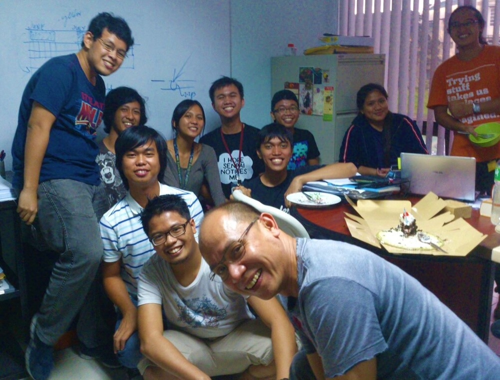
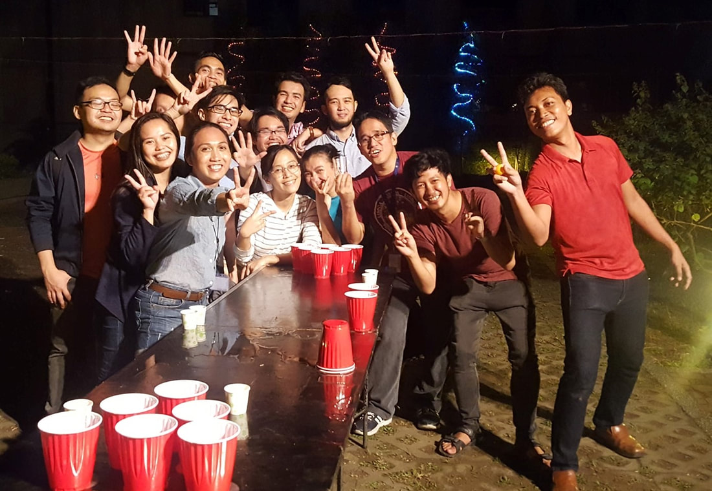

Hi, I'm Reggie, hailing from Calamba City, Philippines, where I completed my high school and part-seminary education before following my passion for physics.

I underwent rigorous scientific training, earning my BS in 2015, MS in 2017, and PhD in 2020 from the esteemed [National Institute of Physics](http://nip.upd.edu.ph/) at the [University of the Philippines](https://upd.edu.ph/). My academic journey has been featured in various publications, including [FlipScience](https://www.flipscience.ph/news/features-news/features/reginald-bernardo-gravitational-physicist), [ABS-CBN News](https://news.abs-cbn.com/spotlight/06/07/20/beyond-einstein-a-young-pinoy-physicist-shines-light-on-black-holes-dark-energy), and [Davao Today](http://davaotoday.com/main/economy/education/a-hope-for-science-community-as-up-alum-becomes-phls-first-gravitational-physicist).

During my university years, I had the privilege of learning under the mentorship of two distinguished physicists, [Perry Esguerra](http://nip.upd.edu.ph/profiles/jose-perico-esguerra/) and [Ian Vega](https://ianvega.wixsite.com/ianvega/about), both of whom greatly influenced my research trajectory. My association with the [Gravity Group](https://gravity-nip.github.io/) further enriched my academic pursuits.

Here are some memorable moments captured during my academic journey:

(Physics undergrads enjoying cake)

(Grad students playing with projectiles)

  

After completing my PhD, I embarked on my first postdoctoral research stint at the [Institute of Physics, Academia Sinica](https://www.phys.sinica.edu.tw/index.php) in Taiwan, where I continued my exploration in theoretical cosmology and gravitational physics.

Presently, I am a postdoc with the Observational Cosmology Junior Research Group at the [Asia Pacific Center for Theoretical Physics](https://www.apctp.org/) in Korea, delving deeper into the intricacies of the cosmos.

Beyond the realms of physics, I find joy in playing chess and basketball, trekking through nature's wonders, and engaging in profound conversations over a drink. My love for cinema extends to favorites such as the gripping masterpiece 'Whiplash', the thought-provoking TV series 'Mr. Robot' (shoutout to the fans!), the timeless sitcom 'The Office US', and the captivating anime 'Fullmetal Alchemist: Brotherhood'.