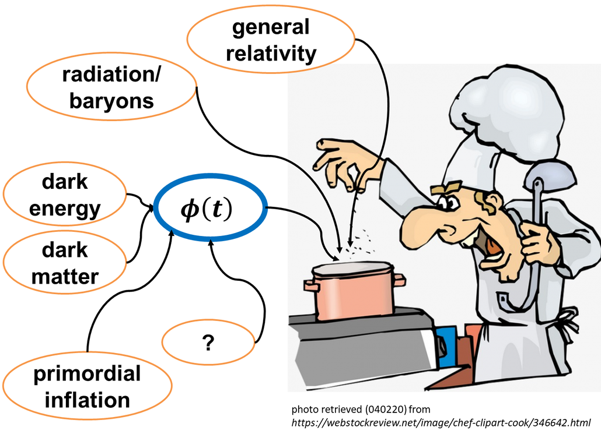

> "Pick a flower on Earth and you move the farthest star." - PD

Hi. I'm Reggie. Cosmologist.

Here is a reflection of my scientific journey and stuff I picked up along the way that I want to share. So please view my [research](./research.html) at your convenience and use any material ([notebooks](https://github.com/reggiebernardo/notebooks), readings, whatsoever) you find in my website however you want. Enjoy, and don't hesitate to [email](mailto:reginaldchristianbernardo@gmail.com) me anytime!

(Cartoon in my PhD thesis poster)

 
Reading starter pack for a good time:  
[Four golden lessons](https://www.nature.com/articles/426389a)  
[Three ways to turn the page after your first paper rejection](https://www.nature.com/articles/d41586-020-01166-2)  
[How to (seriously) read a scientific paper](https://www.sciencemag.org/careers/2016/03/how-seriously-read-scientific-paper)  
[Physics … is for girls?](https://physicstoday.scitation.org/doi/full/10.1063/PT.3.5061)
