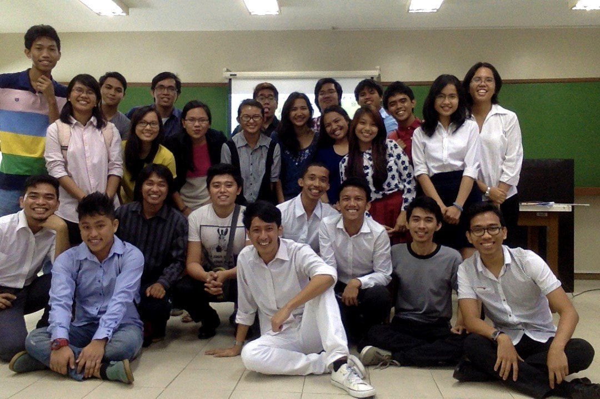
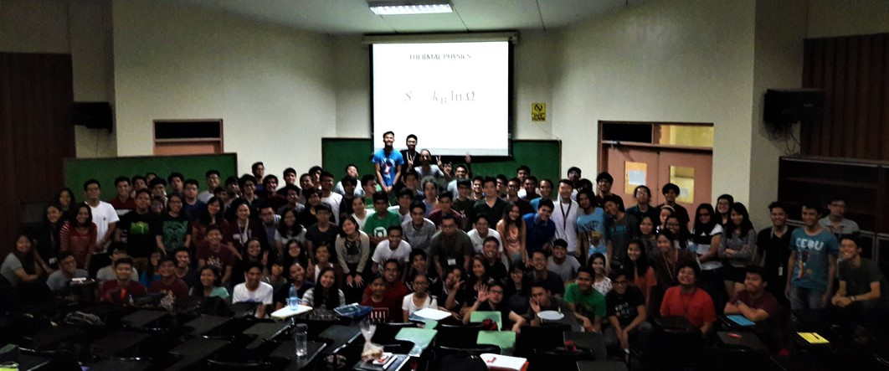

> "Naglalaho sa loob ng mga klase ang mga hadlang na itinatayo ng politika upang hatiin ang mga lahi, natutunaw wari sa alab ng kaalaman at kabataan."  
>
> — JR, *Fili*, *Isang Bahay ng mga Estudyante*

### Teaching Philosophy

Physics is an incredible subject that explores the fundamental building blocks of nature and the vast astronomical objects that shape our existence. Yet, it’s often seen as difficult or boring due to how it's portrayed in basic education. I believe this perception can change.

In high school and college, I was fortunate to have teachers who made physics engaging and accessible, helping me appreciate its elegance and power. Physics is challenging, but it’s far from impossible. By breaking down complex ideas into simple, relatable terms and emphasizing real-world applications, anyone can grasp its core concepts and value.

My goal is to pass on this passion, particularly to young people in the Philippines, showing them that physics is not just a subject, but a pathway to understanding the world and building a meaningful career.

### Experience

I have had the privilege of teaching a variety of physics courses across different levels as an Instructor and later an Assistant Professor at [NIP-UPD](http://nip.upd.edu.ph/). As a lecturer, I have taught subjects such as particle physics, nuclear theory, thermodynamics, relativity, and quantum physics to engineering, science, and physics majors. Additionally, I have instructed laboratory courses in elementary mechanics, thermodynamics, and modern Physics for the same group of students. Beyond teaching, I have also served as a grader for courses including classical mechanics, electromagnetism, quantum mechanics, mathematical physics, solid state physics, and both general and advanced general relativity, catering to both undergraduate and graduate physics majors.

It was my absolute pleasure to have also been a mentor to an incredible number of students in the Philippines and Taiwan, all of whom have successfully defended their degrees and are now continuing their studies or contributing to the industry.

<!-- | :--- | :---: |
| **Lecture** | Particle Physics, Nuclear Theory, Thermodynamics, Relativity, Quantum Physics |
| | For: Engineering, Science and Physics majors |
| **Lab** | Elementary Mechanics, Thermodynamics, Modern Physics |
| | For: Engineering, Science and Physics majors |
| **Grader** | Classical Mechanics, Electromagnetism, Quantum Mechanics, Mathematical Physics, Solid State Physics, General and Advanced General Relativity |
| | For: Undergraduate and Graduate Physics majors | -->

<!-- 
(Lab class, 2015)

  

(Lecture class, 2017)

   -->